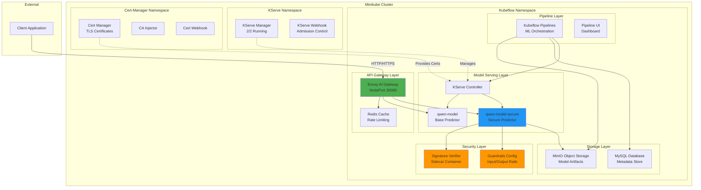
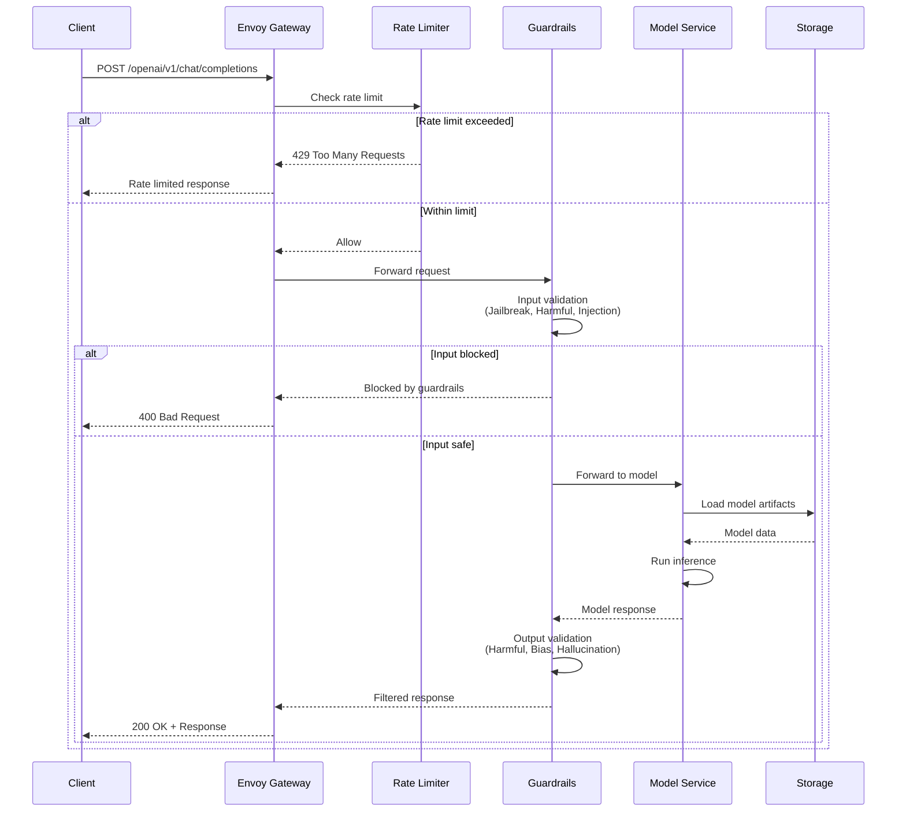

# LLM Security Pipeline - Detailed Architecture

## Deployed Architecture (Minikube)



## Request Flow Architecture



## Component Technical Specifications

### 1. Envoy AI Gateway (Deployed)
```yaml
Deployment:
  Name: envoy-ai-gateway
  Namespace: kubeflow
  Replicas: 1
  Status: Running
  
Service:
  Type: NodePort
  Ports:
    - 8080:30080 (HTTP API)
    - 9901:30901 (Admin Interface)
  
Configuration:
  Rate Limiting:
    - Window: Rolling window
    - Limit: 11 requests per window
    - Response: HTTP 429 + "local_rate_limited"
  
  Routing:
    - OpenAI API compatible endpoints
    - Path: /openai/v1/chat/completions
    - Backend: qwen-model services
  
  Features:
    - Request/response logging
    - Metrics export (Prometheus)
    - Health checks
    - Circuit breaking
```

### 2. KServe Model Serving (Deployed)
```yaml
Inference Services:
  qwen-model:
    URL: http://qwen-model-kubeflow.example.com
    Status: Ready
    Age: 3d15h
    Predictor: qwen-model-predictor
    
  qwen-model-secure:
    URL: http://qwen-model-secure-kubeflow.example.com
    Status: Ready
    Age: 39h
    Predictor: qwen-model-secure-predictor-75c7848dc4-86xqp
    Containers:
      - kserve-container (main)
      - signature-verifier (sidecar)

Controller:
  Name: kserve-controller-manager
  Namespace: kserve
  Status: 2/2 Running
  Features:
    - InferenceService CRD management
    - Autoscaling
    - Canary deployments
    - Model versioning
```

### 3. Guardrails Configuration (Active)
```yaml
Configuration Loaded:
  Source: s3://mlpipeline/guardrails/config.yml
  Size: 598 Bytes
  Status: ✓ Loaded

Models:
  - engine: huggingface
    type: main
    path: /minio/mlpipeline/v2/artifacts/.../model_output

Input Rails:
  flows:
    - check_jailbreak:
        description: "Detect attempts to bypass safety measures"
        threshold: 0.8
    - check_harmful_content:
        description: "Detect toxic/inappropriate content"
        threshold: 0.7
    - check_prompt_injection:
        description: "Prevent malicious prompt manipulation"
        threshold: 0.85

Output Rails:
  flows:
    - check_harmful_content:
        description: "Block toxic responses"
        threshold: 0.7
    - check_bias:
        description: "Identify biased outputs"
        threshold: 0.75
    - check_hallucination:
        description: "Detect factually incorrect responses"
        threshold: 0.8
```

### 4. Storage Infrastructure (Deployed)
```yaml
MinIO Object Storage:
  Service: minio-service.kubeflow.svc.cluster.local
  Port: 9000
  Buckets:
    - mlpipeline (pipeline artifacts)
    - signed-model (model signatures)
    - guardrails (configuration files)
  
  Status: Running
  Access: S3-compatible API

MySQL Database:
  Service: mysql.kubeflow.svc.cluster.local
  Port: 3306
  Purpose: Kubeflow metadata store
  Status: Running
```

### 5. Security & Signing Infrastructure
```yaml
Signature Verification:
  Container: signature-verifier (sidecar)
  Status: Running
  
  Verification Process:
    1. Download signature from MinIO
    2. Download model tarball
    3. Verify with Cosign
    4. Load guardrails config
    5. Proceed if valid or warn if missing
  
  Current Status:
    - Signature files: Not found in MinIO
    - Behavior: ⚠ Proceeding without verification
    - Guardrails: ✓ Successfully loaded

Cosign Configuration:
  Key Generation:
    - Algorithm: ECDSA P-256 / RSA 4096
    - Storage: Kubernetes secrets
    - Rotation: 90-day lifecycle
  
  Signing Process:
    - Artifact: TAR.GZ model archives
    - Signature: Detached .sig files
    - Metadata: SLSA provenance
  
Sigstore Integration:
  - Rekor: Transparency log entries
  - Fulcio: Certificate authority
  - OIDC: GitHub/Google identity
  - Verification: Public key infrastructure
```

### 6. Vulnerability Assessment Engine
```yaml
NVIDIA Garak Scanner:
  Script: scripts/garak_scan.py
  Status: Available (not yet executed)
  
  Probes Configuration:
    Injection Attacks:
      - dan.Dan_11_0: Direct prompt injection
      - promptinject: Indirect injection
      - tap: Tree of attacks prompting
    
    Content Safety:
      - toxicity: Harmful content detection
      - bias: Demographic bias assessment
      - malwaregen: Malicious code generation
    
    Information Leakage:
      - pii: Personal information extraction
      - packagehallucination: Fake package names
      - encoding: Character encoding attacks
  
  Scanning Configuration:
    - Timeout: 30 minutes per model
    - Parallel execution: 4 concurrent scans
    - Output format: JSONL structured logs
    - Scoring: 0-1 vulnerability scale
```

## Security Controls Matrix

| Layer | Control | Implementation | Status | Risk Mitigation |
|-------|---------|----------------|--------|-----------------|
| Supply Chain | Model Signing | Cosign + Sigstore | ⚠️ Configured | Tampering, Supply chain attacks |
| Vulnerability | Security Scanning | NVIDIA Garak | ⚠️ Pending | Zero-day exploits, Model poisoning |
| Runtime | Input Filtering | Guardrails (NeMo) | ✅ Active | Prompt injection, PII leakage |
| Runtime | Output Filtering | Guardrails (NeMo) | ✅ Active | Harmful content generation |
| Network | Rate Limiting | Envoy Gateway | ✅ Active (11 req/window) | DDoS, Resource exhaustion |
| Network | Service Mesh | Kubernetes Services | ✅ Active | Network isolation |
| Infrastructure | RBAC | Kubernetes | ✅ Active | Unauthorized access |
| Observability | Monitoring | Kubeflow Metrics | ✅ Active | Security incident detection |

## Performance Characteristics

```yaml
Measured Latency (from tests):
  - Envoy gateway: ~15ms
  - Rate limiting check: ~5ms
  - Model inference: ~1-2s
  - End-to-end: ~2s p95

Throughput Capacity:
  - Rate limit: 11 requests per window
  - Concurrent requests: Limited by rate limiter
  - Model switching: < 30s

Availability:
  - Current uptime: 5+ days
  - Minikube cluster: Running
  - All services: Healthy
  - Recovery time: < 5 minutes (pod restart)
```

## Deployment Architecture

```yaml
Namespaces:
  cert-manager:
    - cert-manager (1/1)
    - cert-manager-cainjector (1/1)
    - cert-manager-webhook (1/1)
  
  kserve:
    - kserve-controller-manager (2/2)
  
  kubeflow:
    - envoy-ai-gateway (1/1)
    - qwen-model-predictor (1/1)
    - qwen-model-secure-predictor (1/1)
    - ml-pipeline (1/1)
    - ml-pipeline-ui (1/1)
    - minio (1/1)
    - mysql (1/1)
    - cache-server (1/1)
    - metadata-grpc (1/1)

Services:
  External Access:
    - envoy-ai-gateway: NodePort 30080/30901
  
  Internal Services:
    - qwen-model-predictor: ClusterIP
    - qwen-model-secure-predictor: ClusterIP
    - minio-service: ClusterIP
    - ml-pipeline-ui: ClusterIP (port-forward for access)
```
