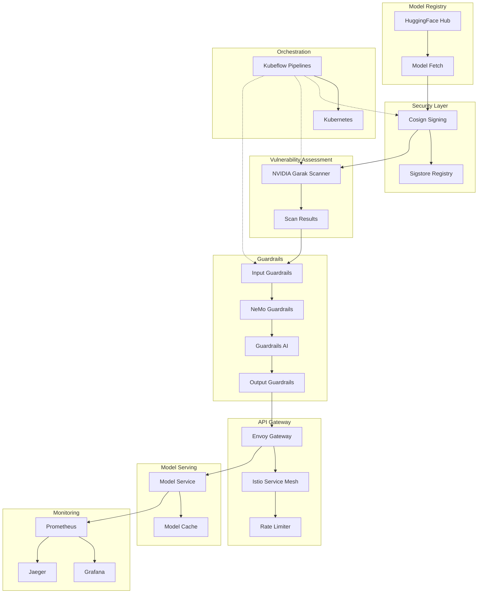

# LLM Security Pipeline - Detailed Architecture

## High-Level Architecture Flow



## Component Technical Specifications

### 1. Model Registry & Fetch Layer
```yaml
Technology Stack:
  - HuggingFace Hub API
  - Python transformers library
  - Git LFS for large files
  
Models Supported:
  - Qwen2.5-0.5B: 1.2GB, Transformer architecture
  - OpenELM-450M: 900MB, Efficient language model
  - Gemma-2-2b-it: 4.8GB, Instruction-tuned
  - DialoGPT-medium: 1.5GB, Conversational AI

Storage Requirements:
  - Local cache: 50GB PVC
  - Model artifacts: ONNX + PyTorch formats
  - Metadata: JSON configuration files
```

### 2. Security & Signing Infrastructure
```yaml
Cosign Configuration:
  Key Generation:
    - Algorithm: ECDSA P-256 / RSA 4096
    - Storage: Kubernetes secrets
    - Rotation: 90-day lifecycle
  
  Signing Process:
    - Artifact: TAR.GZ model archives
    - Signature: Detached .sig files
    - Metadata: SLSA provenance
  
Sigstore Integration:
  - Rekor: Transparency log entries
  - Fulcio: Certificate authority
  - OIDC: GitHub/Google identity
  - Verification: Public key infrastructure
```

### 3. Vulnerability Assessment Engine
```yaml
NVIDIA Garak Probes:
  Injection Attacks:
    - dan.Dan_11_0: Direct prompt injection
    - promptinject: Indirect injection
    - tap: Tree of attacks prompting
  
  Content Safety:
    - toxicity: Harmful content detection
    - bias: Demographic bias assessment
    - malwaregen: Malicious code generation
  
  Information Leakage:
    - pii: Personal information extraction
    - packagehallucination: Fake package names
    - encoding: Character encoding attacks
  
Scanning Configuration:
  - Timeout: 30 minutes per model
  - Parallel execution: 4 concurrent scans
  - Output format: JSONL structured logs
  - Scoring: 0-1 vulnerability scale
```

## Security Controls Matrix

| Layer | Control | Implementation | Risk Mitigation |
|-------|---------|----------------|-----------------|
| Supply Chain | Model Signing | Cosign + Sigstore | Tampering, Supply chain attacks |
| Vulnerability | Security Scanning | NVIDIA Garak | Zero-day exploits, Model poisoning |
| Runtime | Input Filtering | Guardrails AI | Prompt injection, PII leakage |
| Runtime | Output Filtering | NeMo Guardrails | Harmful content generation |
| Network | Rate Limiting | Envoy Gateway | DDoS, Resource exhaustion |
| Network | mTLS | Istio Service Mesh | Man-in-the-middle, Eavesdropping |
| Infrastructure | RBAC | Kubernetes | Unauthorized access |
| Observability | Monitoring | Prometheus + Grafana | Security incident detection |

## Performance Characteristics

```yaml
Latency Targets:
  - Input filtering: < 100ms p95
  - Model inference: < 2s p95
  - Output filtering: < 50ms p95
  - End-to-end: < 3s p95

Throughput Capacity:
  - Concurrent requests: 100
  - Requests per second: 50
  - Daily request volume: 4.3M
  - Model switching: < 30s

Availability:
  - Target SLA: 99.9% uptime
  - Recovery time: < 5 minutes
  - Backup strategy: Multi-AZ deployment
  - Disaster recovery: Cross-region replication
```
